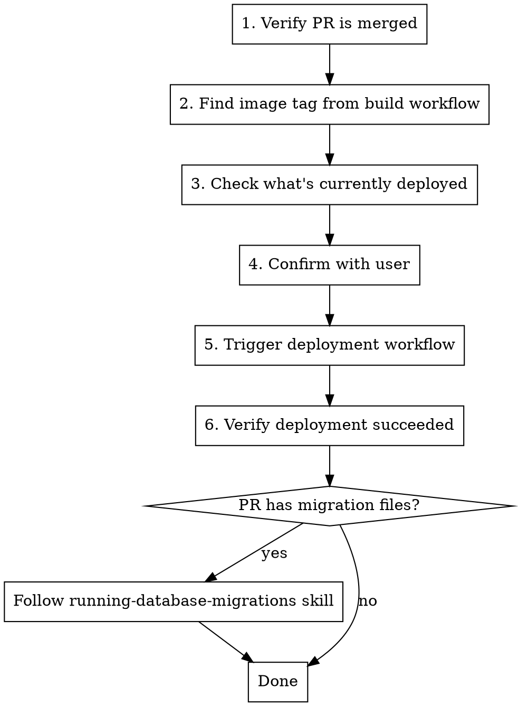

# Deploying to Production

## Overview

Deploy a merged PR to production by finding its Docker image tag from the CI build and triggering the manual deployment workflow via GitHub CLI.

## When to Use

- User wants to deploy a specific PR to production
- User asks what's currently deployed in prod
- User wants to find the Docker image tag for a PR
- User asks to "ship", "release", or "deploy"

## Infrastructure Context

| Component | Value |
|---|---|
| Registry | `registry.aitire.cloud` |
| Image | `afianza/afsync/afianza-ac/<repo-name>` |
| Image tag | GitHub Actions run ID (numeric) |
| Build workflow | `commit into main` (runs on merge) |
| Deploy workflow | `manual deployment on prod` (workflow_dispatch) |
| Deploy input | `image_tag` (just the numeric run ID, not the full registry URL) |

## Process



### Step 1: Verify PR is merged

```bash
gh pr view <PR-number> --json state,mergedAt,title
```

PR must be in `MERGED` state. If not, stop and inform the user.

### Step 2: Find the Docker image tag

The image tag is the **run ID** of the "commit into main" workflow that ran when the PR was merged.

```bash
# Get the PR merge date to narrow down the search
gh pr view <PR-number> --json mergedAt --jq '.mergedAt'

# List recent builds and match by date
gh run list --workflow "commit into main" --limit 10

# Confirm the image tag from the build logs
gh run view <run-id> --log 2>&1 | grep -i "IMAGE_VERSION"
```

The `IMAGE_VERSION` in the logs is the image tag (same as the run ID).

**Multiple PRs merged:** If several PRs were merged since the last deploy, the most recent build image includes all of them (since each build runs on the latest `main`). Inform the user which PRs are included — not just the one they asked about.

### Step 3: Check what's currently deployed

```bash
# Find the last successful prod deployment
gh run list --workflow "manual deployment on prod" --limit 1

# Check which image tag it used
gh run view <last-deploy-run-id> --log 2>&1 | grep -i "image_tag"
```

Inform the user what's currently in prod so they can make an informed decision.

### Step 4: Confirm with user

**ALWAYS ask for explicit confirmation before deploying.** Show:
- The PR being deployed (number + title)
- The image tag
- What's currently deployed

### Step 5: Trigger the deployment

```bash
gh workflow run "manual deployment on prod" -f image_tag=<run-id>
```

The `image_tag` input is **just the numeric run ID**, not the full registry URL.

### Step 6: Verify deployment succeeded

```bash
# Check the new run appeared and completed
gh run list --workflow "manual deployment on prod" --limit 1 --json databaseId,status,conclusion,createdAt
```

Wait for `status: completed` and `conclusion: success`.

### Step 7: Check for pending migrations

After a successful deploy, check if the PR included migration files:

```bash
# Check the PR's changed files for migrations
gh pr view <PR-number> --json files --jq '.files[].path' | grep src/migrations/Migration
```

If migration files are found, inform the user and follow the **running-database-migrations** skill to apply them on the target environments (DEV and/or PROD).

## Common Mistakes

| Mistake | Prevention |
|---|---|
| Passing full registry URL as image_tag | Only pass the numeric run ID (e.g., `22581204009`) |
| Deploying a PR that isn't merged | Always check PR state first |
| Deploying without user confirmation | Always show what will be deployed and ask for confirmation |
| Confusing build run ID with deploy run ID | Build = "commit into main" run. Deploy = "manual deployment on prod" run |
| Not checking what's currently in prod | Always show current state so user can compare |
