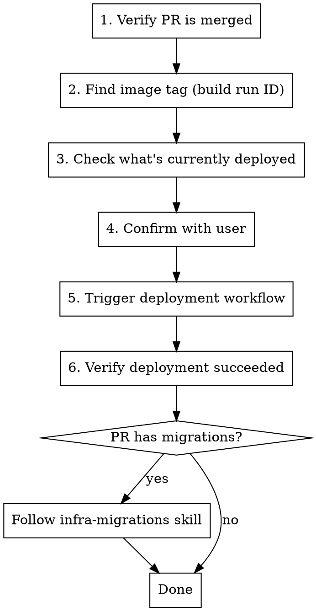

# Deploying to Production

## Overview

Deploy a merged PR to production by finding its Docker image tag from the CI build and triggering the manual deployment workflow via GitHub CLI.

## Configuration

Read project-specific values from the project's CLAUDE.md (`## Infrastructure` section):
- Build workflow name, deploy workflow name, image tag input field name

The image tag is always the **GitHub Actions run ID** (numeric `databaseId`) of the build workflow run.

## Process

See [references/commands.md](references/commands.md) for all shell commands per step.

## Common Mistakes

| Mistake | Prevention |
|---|---|
| Not reading CLAUDE.md | Workflow names and input field vary per project. |
| Passing full registry URL as image tag | Only pass the numeric run ID. |
| Deploying a PR that isn't merged | Always verify PR state first. |
| Deploying without confirmation | Always show what will be deployed and ask. |
| Confusing build run ID with deploy run ID | Build = CI on merge. Deploy = manual workflow. |
| Not checking what's currently in prod | Always show current state before deploying. |
