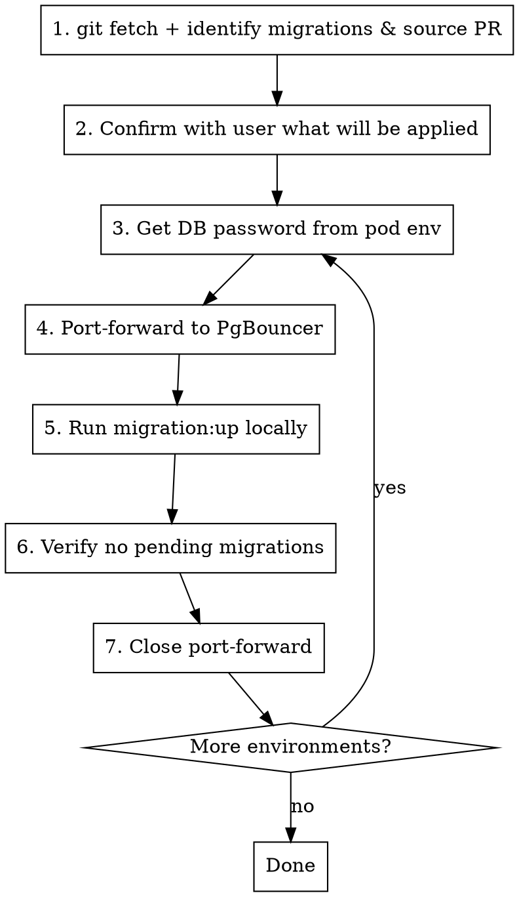

# Running Database Migrations

## Overview

Run MikroORM migrations on remote environments (DEV/PROD) via port-forward to PgBouncer, since `@mikro-orm/migrations` is a devDependency not available in production images.

## When to Use

- New migration files have been merged and deployed but tables don't exist yet
- Schema changes need to be applied to DEV or PROD databases
- User asks to "run migrations" on a remote environment

## Infrastructure Context

| Environment | kubectl context | Namespace | PgBouncer service | Database name | DB User |
|---|---|---|---|---|---|
| DEV | `dev` | `plataformadato` | `pd-infra-pgbouncer` | `mp-service-obligations-api-dev` | `postgres` |
| PROD | `prod` | `plataformadato` | `pd-infra-pgbouncer` | `mp-service-obligations-api-prod` | `postgres` |

PgBouncer port: `6432`

## Process



### Step 1: Identify pending migrations and source PR

Before running anything, ensure local `main` is up to date and determine which migration files need to be applied.

```bash
# Ensure local main is up to date
git fetch origin main
git checkout main && git pull origin main

# List migration files (excluding .gitkeep and snapshots)
ls src/migrations/Migration*.ts

# Find which PR/commit introduced each migration file
git log --oneline -- src/migrations/Migration<timestamp>.ts
```

Cross-reference with merged PRs to confirm the migration is expected:

```bash
gh pr view <PR-number> --json title,state,mergedAt
```

**Show the user:** migration filename, what SQL it runs (CREATE TABLE, ALTER, etc.), and which PR it came from. The user must understand what schema changes will be applied before proceeding.

### Step 2: Confirm with user

Present a summary:
- Migration file(s) to apply
- Source PR (number + title)
- What the migration does (tables created, columns altered, etc.)
- Target environments

**ALWAYS get explicit confirmation before running migrations, especially on PROD.**

### Step 3: Get DB password from pod

```bash
# Find a running pod
kubectl --context=<ctx> get pods -n plataformadato | grep mp-service-obligations-api

# Extract password
kubectl --context=<ctx> exec -n plataformadato <pod-name> -- env | grep POSTGRES_PASSWORD
```

### Step 4: Port-forward to PgBouncer

```bash
kubectl --context=<ctx> port-forward -n plataformadato svc/pd-infra-pgbouncer 6432:6432
```

Run this in the background so the terminal stays available.

### Step 5: Run migrations locally

```bash
POSTGRES_DB=<db-name> \
POSTGRES_USER=postgres \
POSTGRES_PASSWORD='<password>' \
POSTGRES_HOST=localhost \
POSTGRES_PORT=6432 \
npx mikro-orm migration:up
```

**Important:** The password may contain special characters (`#`, `?`, etc.) — always single-quote it.

### Step 6: Verify migration applied correctly

Before closing the port-forward, confirm the schema changes were applied:

```bash
# Check the migration was recorded (uses same env vars from step 5)
POSTGRES_DB=<db-name> \
POSTGRES_USER=postgres \
POSTGRES_PASSWORD='<password>' \
POSTGRES_HOST=localhost \
POSTGRES_PORT=6432 \
npx mikro-orm migration:pending
```

Should return no pending migrations. If migrations are still pending, investigate before proceeding.

### Step 7: Close port-forward

Stop the background port-forward process before moving to the next environment.

## Order of Operations

**Always run DEV first**, verify success, then proceed to PROD. If DEV fails, do NOT proceed to PROD — investigate first.

## Common Mistakes

| Mistake | Prevention |
|---|---|
| Trying to run migrations inside the pod | `@mikro-orm/migrations` is a devDependency, not in the Docker image. Always run locally via port-forward. |
| Forgetting to close port-forward before switching environments | Stop the background process between environments to avoid port conflicts. |
| Not quoting the password | Passwords contain special chars — always use single quotes. |
| Running PROD before verifying DEV | Always migrate DEV first as a safety check. |
