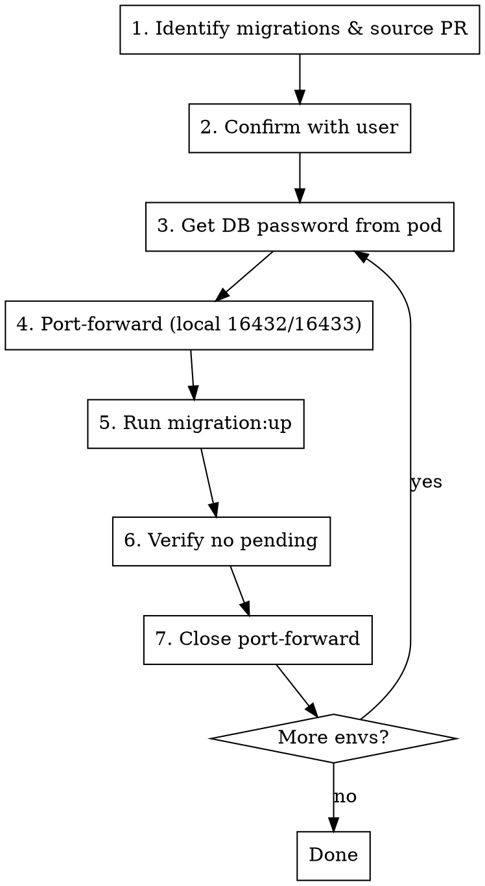

# Running Database Migrations

## Overview

Run MikroORM migrations on remote environments (DEV/PROD) via port-forward to PgBouncer, since `@mikro-orm/migrations` is a devDependency not available in production images.

## Configuration

Read project-specific values from the project's CLAUDE.md (`## Infrastructure` section):
- kubectl contexts, namespace, PgBouncer service name, database names
- Migration npm script (e.g. `npm run migrations:up`)

## Process

See [references/commands.md](references/commands.md) for all shell commands per step.

## Order of Operations

**Always run DEV first.** If DEV fails, do NOT proceed to PROD.

## Common Mistakes

| Mistake | Prevention |
|---|---|
| Running migrations inside the pod | `@mikro-orm/migrations` is a devDependency. Run locally via port-forward. |
| Not reading CLAUDE.md first | Contexts, namespace, DB names, and scripts vary per project. |
| Port conflict between envs | Use local port `16432` for DEV, `16433` for PROD. |
| Not quoting the password | Special chars (`#`, `?`) — always single-quote. |
| Running PROD before DEV | Always verify DEV first. |
| `CheckConstraintViolationException` on UPDATE | `DROP CONSTRAINT IF EXISTS` **before** the UPDATE, re-add after. |
| Ghost entries in `mikro_orm_migrations` | Consolidated/deleted migrations — harmless, MikroORM ignores them. |
